<p align="center">
  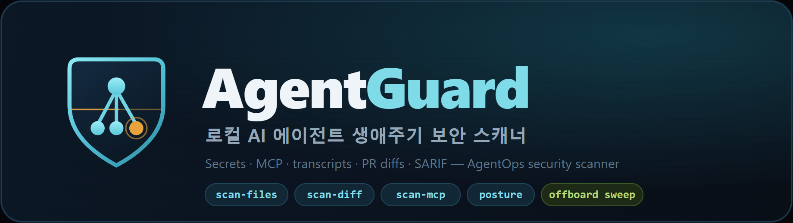
</p>

# AgentGuard

[English](README.en.md)

[](https://www.npmjs.com/package/@pk42ac/agentguard)


Licensed under the [Apache License 2.0](LICENSE).

**Codex, Claude Code, Hermes, MCP 설정, 에이전트 트랜스크립트/로그, PR diff를 운영하는 한국 팀을 위한 한국어 우선 AgentOps 보안 스캐너.**

AgentGuard는 한국 팀이 에이전트 기반 개발을 운영할 때 노출될 수 있는 비밀 값, 위험한 MCP 권한, 에이전트 셸 동작, PR diff 리스크를 배포 전에 확인하도록 돕습니다. 지금의 한국어 우선 범위는 문서, 정책 설명, 팀 협업 가이드, 기본 터미널/Markdown 리포트입니다. CLI commands, rule IDs, JSON/SARIF/API/machine fields는 CI/CD와 글로벌 보안 도구 연동을 위해 English-compatible, global-standard 계약으로 유지합니다.

v0.3.0부터는 **AI 코딩 에이전트 생애주기 보안**을 로컬 워크플로로 제공합니다 — 신입 입사자 PC의 설치된 AI 도구·권한을 점검하는 **온보딩 인스펙션**, 퇴사자 PC의 잔여 자격증명을 훑어 **승인 후에만 삭제하고 감사 리포트를 남기는 오프보딩 스윕**, 그리고 이를 운영하는 **관리자 전용 로컬 터미널 대시보드**(`agentguard`). 이 로컬 워크플로는 대상 PC에서 웹·중앙 서버 없이 오프라인으로 동작하며, 아래 v0.5의 컨트롤 플레인·웹 콘솔은 선택적(opt-in) 하이브리드 SaaS 레이어입니다.

<p align="center">
  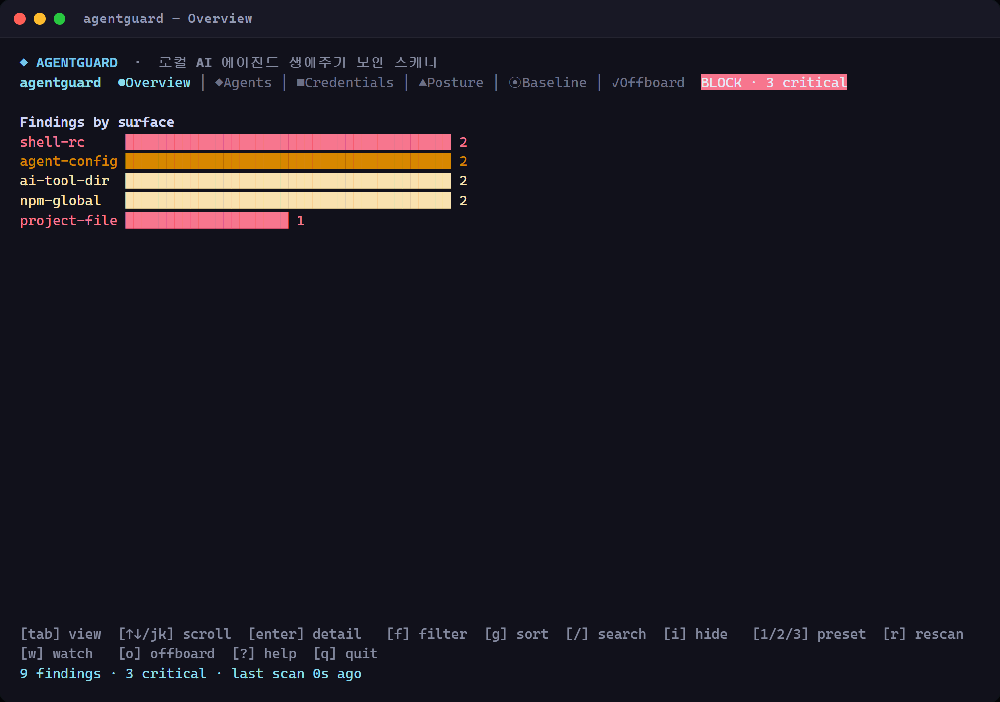
</p>

## 설치

```bash
npm install -g @pk42ac/agentguard
```

## 빠른 시작

```bash
# Scan a repo/workspace (기본 Markdown 리포트는 한국어)
agentguard scan-files .

# 로컬 설치/예제/스캐너 준비 상태 확인
agentguard doctor

# 팀/CI readiness gate용 machine-readable JSON
agentguard doctor --json

# Claude/Codex/Gemini/MCP 로컬 설정의 에이전트 권한 posture 점검
agentguard posture .

# 영어 Markdown 리포트가 필요하면
agentguard scan-files . --lang en

# Scan a PR diff
git diff origin/main...HEAD | agentguard scan-diff

# Emit SARIF for GitHub code scanning
git diff origin/main...HEAD | agentguard scan-diff --sarif --out agentguard.sarif

# Scan Codex/MCP config
agentguard scan-mcp < ~/.codex/config.toml

# stdin 리다이렉트(<)가 안 되는 환경(PowerShell 등)은 파일 경로 인자 사용
agentguard scan-mcp ~/.codex/config.toml

# 인터랙티브 대시보드 (TTY): 7탭(워크플로 순서) + 검색/정렬/프리셋/watch/마우스 + /offboard 스윕
agentguard        # 또는: agentguard repl
```

TTY에서 맨 `agentguard`(또는 `agentguard repl`)를 실행하면 tokscale 스타일 **풀스크린 관리자 대시보드**가 열립니다. 상단 7개 탭은 스캔→수정→검증 워크플로 순서(Overview/Credentials/Posture/Agents/Baseline/Offboard/Fleet)로 배치되어 있으며 `tab`/`←→`로 전환하고, findings 리스트를 `↑↓`(또는 `j`/`k`) 탐색·`enter` 상세로 살펴봅니다. 상세 패널에는 전체 경로와 **심각도 근거·카테고리별 조치 가이드**가 함께 표시됩니다. `f` 심각도 필터, `g` 심각도 정렬, `/` 실시간 검색(surface·경로·evidence), `i` 세션 숨김(파일 미기록·verdict 불변), `e` 선택한 항목을 에디터로 열기(자격증명·포스처 탭), `1`/`2`/`3` 스캔 프리셋(Quick/Project/Full — Quick은 즉시, Full은 확인 후 실행)+실시간 서피스 진행, `w` 30초 자동 재스캔, `?` 전체 단축키 오버레이, 그리고 마우스(휠 스크롤·탭 클릭)를 지원합니다. Overview에는 서피스별 findings 바 차트와 `PASS/REVIEW/BLOCK` verdict 배지가, **Baseline 탭에서는 `[s]`로 스냅샷 저장 후 이전 baseline 대비 drift(생김/사라짐/로테이션)**를 확인하며, **Fleet 탭에서는 로그인 시 컨트롤 플레인의 조직 전체 findings 요약(심각도별·자산별)을 확인**합니다. 하단 바에는 `[o]` 오프보딩 스윕 · `[r]` 재스캔 · `[q]` 종료가 표시됩니다. non-TTY(파이프/CI)에서는 기존 도움말이 그대로 출력되어 스크립트 하위호환이 유지됩니다. 모든 정리(삭제) 작업은 명시적 승인(y) 후에만 적용되며, 삭제 대상은 `~/.agentguard/trash`로 이동(백업)되어 복구 가능합니다.

## 스크린샷

아래는 실제 `agentguard`를 실행해 캡처한 화면입니다. (샘플 데이터 기준)

**관리자 대시보드 — Credentials 탭 + 상세 패널** (`↑↓`/`enter`로 탐색, 심각도 근거·조치 가이드·redacted evidence)

<p align="center">
  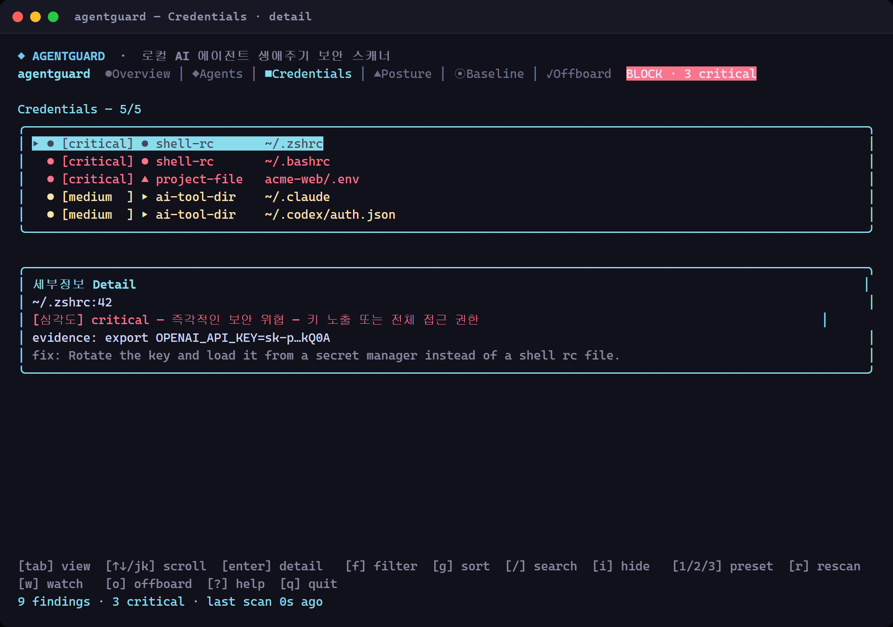
</p>

<table>
  <tr>
    <td width="50%">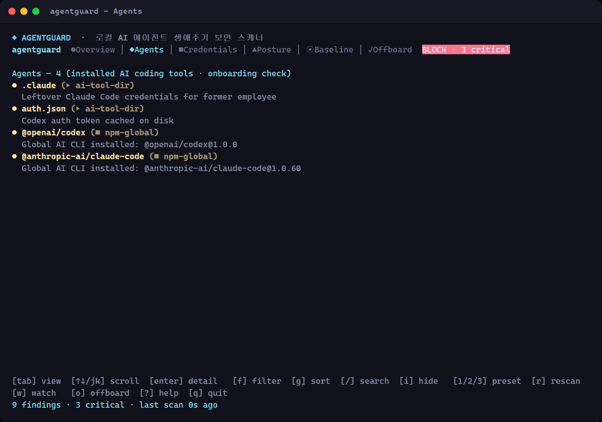<br/><sub><b>Agents</b> — 설치된 AI CLI·툴 인벤토리(온보딩 체크)</sub></td>
    <td width="50%">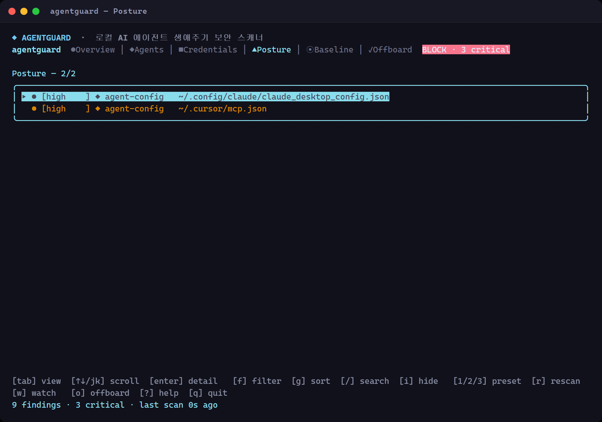<br/><sub><b>Posture</b> — MCP/에이전트 config 과다 권한</sub></td>
  </tr>
  <tr>
    <td width="50%">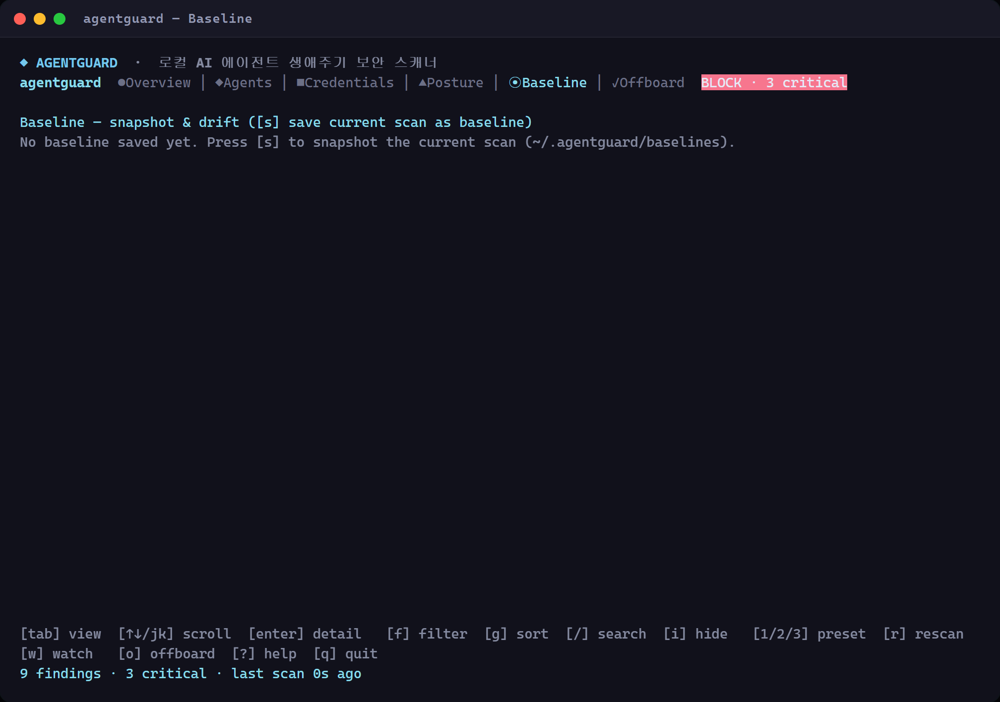<br/><sub><b>Baseline</b> — 스냅샷 저장 후 drift 비교</sub></td>
    <td width="50%">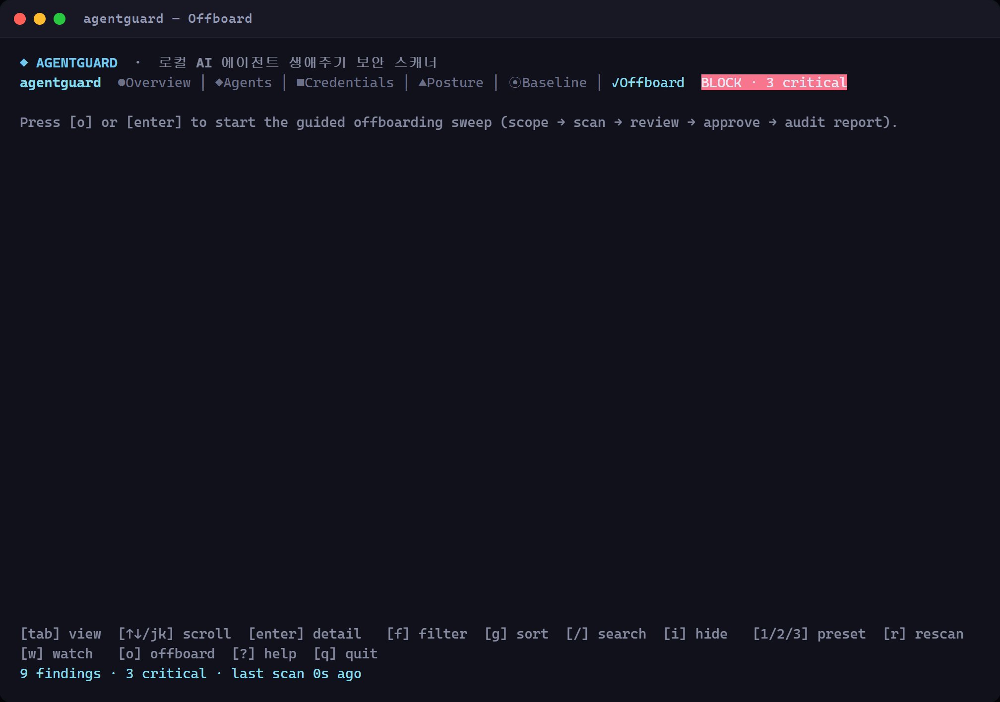<br/><sub><b>Offboard</b> — 승인 기반 오프보딩 스윕</sub></td>
  </tr>
</table>

<details>
<summary><b>전체 단축키 오버레이 (<code>?</code>)</b></summary>

<p align="center">
  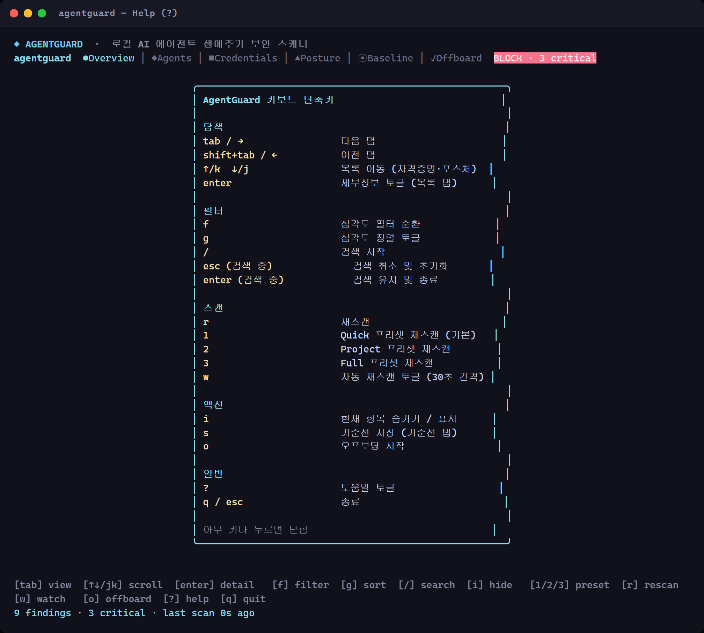
</p>
</details>

**CLI 리포트 — `agentguard doctor` · `scan-diff`** (터미널/CI용 Markdown 리포트, 기본 한국어)

<p align="center">
  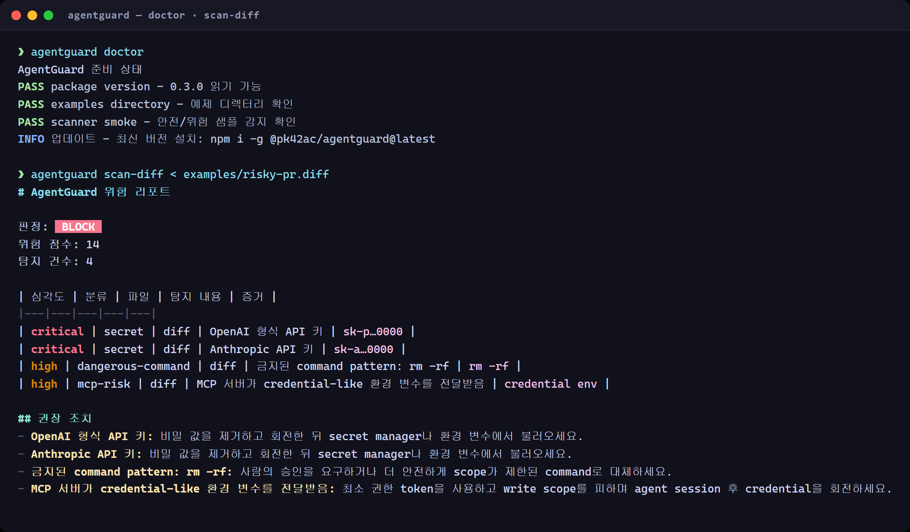
</p>

## 왜 필요한가

AI 코딩 에이전트는 이제 코드베이스, 터미널, GitHub, 데이터베이스, Slack, Drive, 내부 도구에 연결됩니다. 기존 SAST 도구는 애플리케이션 코드를 검사하지만, 다음 질문에는 충분히 답하지 못합니다.

> 에이전트가 무엇을 읽고, 실행하고, 노출하고, 변경하려 했는가?

AgentGuard는 한국어 우선 운영 문서와 정책 설명을 제공하면서도 자동화와 보안 도구가 기대하는 영어 기반 계약은 유지합니다.

## 검사 대상

| Surface | Examples |
|---|---|
| Secrets | OpenAI/Anthropic/GitHub/Google-style tokens, credential-shaped environment values |
| Agent logs | risky shell commands, sensitive paths, unsafe operations visible in transcripts/logs |
| PR diffs | newly-added secrets, PII, dangerous commands, agent policy violations |
| MCP/Codex config | broad filesystem roots, writable paths, credential passthrough, full-access servers |
| Policy files | YAML/JSON policy aliases, malformed policy documents, unsafe duplicates |
| Shell rc keys | `.bashrc`/`.zshrc`/PowerShell `$PROFILE`에 export된 API 키·credential-named 변수 |
| npm global AI CLIs | 전역 설치된 AI 코딩 CLI(Claude Code/Codex/Gemini 등) — 온보딩·오프보딩 신호 |
| AI tool config | `~/.claude`·`~/.codex` 등 잔여 자격증명, Claude Desktop/Cursor MCP config |

## 예시 finding

```text
BLOCK  secret.github_token
Found a GitHub token in an agent-visible diff. Evidence is redacted before reporting.

REVIEW  mcp.broad_filesystem_access
MCP configuration exposes a broad filesystem root with write-capable access.
```

Verdicts:

- `PASS`: findings 없음
- `REVIEW`: 사람이 검토해야 할 비치명 finding
- `BLOCK`: critical secret/full-access finding 또는 높은 aggregate risk

## 호환성 경계

한국어 README는 제품 포지셔닝, 운영 설명, 팀 협업 맥락을 한국어 우선으로 제공합니다. 하지만 다음 machine-facing 계약은 한국어로 바꾸지 않습니다.

- CLI commands: `agentguard scan-files`, `agentguard scan-diff`, `agentguard scan-mcp`, `agentguard doctor`
- Rule IDs: `secret.github_token`, `mcp.broad_filesystem_access`
- Markdown terminal reports: 기본값은 한국어, `--lang en`으로 영어 Markdown 출력 가능
- SARIF/API/machine fields: GitHub code scanning, JSON, SARIF 2.1.0, CI 파서가 읽는 필드 이름
- Package metadata and command flags: npm, shell, GitHub Actions에서 쓰는 영어 식별자

이 경계 덕분에 한국 팀은 문서를 한국어로 읽고 운영할 수 있고, CI/CD, SARIF, API, 보안 리포팅은 기존 글로벌 도구와 그대로 연동됩니다.

## 문서

- [GitHub Actions / SARIF setup](docs/github-action.md)
- [Team rollout baseline guide](docs/team-rollout-baseline-guide.md)
- [Policy files](docs/policy.md)
- [Rule surfaces](docs/rules.md)
- [Examples](docs/examples.md)
- [AX prelim submission pack](docs/ax-prelim-submission-pack.md)
- [AX prelim judge Q&A](docs/ax-prelim-judge-qa.md)
- [AX rule compliance checklist](docs/ax-rule-compliance-checklist.md)
- [AX demo scenario matrix](docs/ax-demo-scenario-matrix.md)
- [AX demo failure mode register](docs/ax-demo-failure-mode-register.md)
- [AX live demo runbook](docs/ax-live-demo-runbook.md)
- [AX demo operator checklist](docs/ax-demo-operator-checklist.md)
- [AX 30-second demo command card](docs/ax-30-second-demo-card.md)
- [AX first-60-seconds evidence priority card](docs/ax-first-60-seconds-evidence-priority.md)
- [AX cross-shell demo command card](docs/ax-cross-shell-demo-command-card.md)
- [AX CLI benchmark quickstart card](docs/ax-cli-benchmark-quickstart-card.md)
- [AX demo-day command rehearsal](docs/ax-demo-day-command-rehearsal.md)
- [AX 90-second judge evidence tour](docs/ax-90-second-judge-evidence-tour.md)
- [AX before/after rollout demo](docs/ax-before-after-rollout-demo.md)
- [AX agent rollback drill](docs/ax-agent-rollback-drill.md)
- [AX adversarial judge checklist](docs/ax-adversarial-judge-checklist.md)
- [AX judge evidence index](docs/ax-judge-evidence-index.md)
- [AX judge evidence ladder](docs/ax-judge-evidence-ladder.md)
- [AX judge rubric crosswalk](docs/ax-judge-rubric-crosswalk.md)
- [AX rollout control map](docs/ax-rollout-control-map.md)
- [AX threat-control traceability card](docs/ax-threat-control-traceability.md)
- [AX rollout acceptance contract card](docs/ax-rollout-acceptance-contract-card.md)
- [AX boardroom go/no-go brief](docs/ax-boardroom-go-no-go-brief.md)
- [AX CI reviewer handoff](docs/ax-ci-reviewer-handoff.md)
- [AX CI evidence handoff card](docs/ax-ci-evidence-handoff-card.md)
- [AX SARIF reviewer loop card](docs/ax-sarif-reviewer-loop-card.md)
- [AX reference command routing card](docs/ax-reference-command-routing-card.md)
- [AX MCP consent/token handoff card](docs/ax-mcp-consent-token-handoff.md)
- [AX MCP third-party server trust boundary card](docs/ax-mcp-third-party-server-trust-boundary.md)
- [AX authorization callback state card](docs/ax-authorization-callback-state-card.md)
- [AX agent asset inventory card](docs/ax-agent-asset-inventory-card.md)
- [AX reviewer channel routing card](docs/ax-reviewer-channel-routing-card.md)
- [AX alert triage queue runbook](docs/ax-alert-triage-queue-runbook.md)
- [AX critical alert routing card](docs/ax-critical-alert-routing-card.md)
- [AX executive risk memo](docs/ax-executive-risk-memo.md)
- [AX real judge demo map](docs/ax-real-judge-demo-map.md)
- [AX judge handoff packet](docs/ax-judge-handoff-packet.md)
- [AX agent permission review packet](docs/ax-agent-permission-review-packet.md)
- [AX approval owner escalation matrix](docs/ax-approval-owner-escalation-matrix.md)
- [AX prompt-injection evidence routing card](docs/ax-prompt-injection-evidence-routing-card.md)
- [AX submission readiness scorecard](docs/ax-submission-readiness-scorecard.md)
- [AX onsite triage card](docs/ax-onsite-triage-card.md)
- [AX onsite decision log](docs/ax-onsite-decision-log.md)
- [AX 6-hour onsite execution board](docs/ax-6-hour-onsite-execution-board.md)
- [AX onsite pivot guide](docs/ax-onsite-pivot-guide.md)
- [AX Rollout references](docs/ax-rollout-references.md)
- [AX reference refresh drill](docs/ax-reference-refresh-drill.md)
- [AX evidence freshness checklist](docs/ax-evidence-freshness-checklist.md)
- [AX evidence expiry revalidation card](docs/ax-evidence-expiry-revalidation-card.md)
- [AX evidence retention policy card](docs/ax-evidence-retention-policy.md)
- [AX policy exception decision tree](docs/ax-policy-exception-decision-tree.md)
- [AX false-positive dispute review card](docs/ax-false-positive-dispute-card.md)
- [AX competitive comparison](docs/ax-competitive-comparison.md)
- [AX public scanner ecosystem triage](docs/ax-public-scanner-ecosystem-triage.md)
- [AX public scanner gap checklist](docs/ax-public-scanner-gap-checklist.md)
- [AX public scanner freshness scorecard](docs/ax-public-scanner-freshness-scorecard.md)
- [AX public signal-to-proof queue](docs/ax-public-signal-to-proof-queue.md)
- [AX competitor objection answer card](docs/ax-competitor-objection-answer-card.md)
- [AX company problem intake kit](docs/ax-company-problem-intake-kit.md)
- [AX evidence receipt checklist](docs/ax-evidence-receipt-checklist.md)
- [AX verdict vocabulary glossary](docs/ax-verdict-vocabulary-glossary.md)
- [AX source-of-record audit card](docs/ax-source-of-record-audit-card.md)
- [AX fork PR artifact fallback card](docs/ax-fork-pr-artifact-fallback-card.md)
- [AX evidence custody chain](docs/ax-evidence-custody-chain.md)
- [AX evidence tamper/replay check](docs/ax-evidence-tamper-replay-check.md)
- [AX evidence bundle manifest](docs/ax-evidence-bundle-manifest.md)
- [AX smoke evidence manifest handoff card](docs/ax-smoke-evidence-manifest-handoff-card.md)
- [AX demo evidence freeze checklist](docs/ax-demo-evidence-freeze-checklist.md)
- [AX evidence freeze sign-off ledger](docs/ax-evidence-freeze-signoff-ledger.md)
- [AX pilot responsibility card](docs/ax-pilot-responsibility-card.md)
- [AX incident response evidence card](docs/ax-incident-response-evidence-card.md)
- [AX finding lifecycle approval card](docs/ax-finding-lifecycle-approval-card.md)
- [AX timeboxed escalation drill](docs/ax-timeboxed-escalation-drill.md)
- [AX CLI trust onboarding card](docs/ax-cli-trust-onboarding-card.md)
- [AX agent change-control evidence card](docs/ax-agent-change-control-evidence-card.md)
- [AX assumption ledger](docs/ax-assumption-ledger.md)
- [AX public-reference delta watch](docs/ax-public-reference-delta-watch.md)
- [AX final company-problem worksheet](docs/ax-final-problem-worksheet.md)
- [AX final submission smoke checklist](docs/ax-final-submission-smoke-checklist.md)
- [Roadmap](docs/roadmap.md)
- [Development harness](docs/harness-workflow.md)

## 예제 파일

- [`examples/risky-mcp.json`](examples/risky-mcp.json) — 위험한 MCP filesystem config
- [`examples/risky-pr.diff`](examples/risky-pr.diff) — fake secret-like material이 포함된 PR diff
- [`examples/agent-transcript.log`](examples/agent-transcript.log) — 위험한 shell behavior가 포함된 agent transcript
- [`examples/expected-report.md`](examples/expected-report.md) — sample markdown report
- [`examples/agentguard.sarif`](examples/agentguard.sarif) — sample SARIF payload

## 팀 PR gate workflow

팀 repo에 바로 붙일 때는 [GitHub Actions / SARIF setup](docs/github-action.md)의 `AgentGuard PR gate` 예제를 권장합니다. 이 reusable action은 PR diff를 스캔하고 Markdown/JSON/SARIF artifact를 만들며, 기본값 `fail-on: block`으로 advisory finding을 제외한 위험 점수 기준 `BLOCK` 판정만 merge gate에서 막습니다.

```yaml
- uses: Sungho-pk42ac/agentguard@main
  with:
    base-sha: ${{ github.event.pull_request.base.sha }}
    head-sha: ${{ github.event.pull_request.head.sha }}
    report-path: agent-risk-report.md
    json-path: agent-risk-findings.json
    sarif-path: agentguard.sarif
    fail-on: block
```

## GitHub code scanning workflow

아래 workflow를 `.github/workflows/agentguard-sarif.yml`로 복사하면 pull request diff를 스캔하고 `agentguard.sarif`를 생성한 뒤 GitHub code scanning에 업로드합니다. `scan-diff --sarif --out agentguard.sarif` 명령은 현재 구현된 CLI flags와 일치합니다.

```yaml
name: AgentGuard code scanning
on:
  pull_request:
    branches: [main]
    types: [opened, synchronize, reopened]

permissions:
  contents: read
  security-events: write

jobs:
  agentguard-sarif:
    runs-on: ubuntu-latest
    steps:
      - uses: actions/checkout@v4
        with:
          fetch-depth: 0

      - uses: actions/setup-node@v4
        with:
          node-version: 22
          cache: npm

      - run: npm ci
      - run: npm run build

      - name: Emit AgentGuard SARIF
        run: |
          git diff --unified=0 ${{ github.event.pull_request.base.sha }}...${{ github.event.pull_request.head.sha }} \
            | node dist/index.js scan-diff --sarif --out agentguard.sarif || true

      - name: Upload AgentGuard SARIF
        uses: github/codeql-action/upload-sarif@v3
        with:
          sarif_file: agentguard.sarif
```

## GitHub PR comment workflow

아래 workflow를 `.github/workflows/agentguard-pr.yml`로 복사하면 pull request diff를 스캔하고 markdown report를 artifact로 보존하며, 같은 report를 PR comment로 게시합니다. Critical findings는 check를 실패시키고, review-level findings는 사람이 검토할 수 있도록 check를 green으로 유지합니다.

```yaml
name: AgentGuard PR scan
on:
  pull_request:
    branches: [main]
    types: [opened, synchronize, reopened]

permissions:
  contents: read
  pull-requests: write

jobs:
  agentguard:
    runs-on: ubuntu-latest
    steps:
      - uses: actions/checkout@v4
        with:
          fetch-depth: 0

      - uses: actions/setup-node@v4
        with:
          node-version: 22
          cache: npm

      - name: Run AgentGuard on PR diff
        id: agentguard
        uses: ./.github/actions/agentguard
        with:
          base-sha: ${{ github.event.pull_request.base.sha }}
          head-sha: ${{ github.event.pull_request.head.sha }}
          report-path: agent-risk-report.md

      - name: Upload AgentGuard report
        if: ${{ !cancelled() }}
        uses: actions/upload-artifact@v4
        with:
          name: agentguard-pr-report
          path: agent-risk-report.md

      - name: Comment AgentGuard report on PR
        if: ${{ !cancelled() }}
        uses: peter-evans/create-or-update-comment@v4
        with:
          issue-number: ${{ github.event.pull_request.number }}
          body-path: agent-risk-report.md
```

## 컨트롤 플레인 (Fleet · Observe)

조직 규모에서는 각 개발자 PC·CI가 로컬 스캔 결과를 중앙 **컨트롤 플레인**에 report하고, 보안팀이 조직 전체 리스크를 한 화면에서 봅니다. 핵심 원칙: **원문·비밀값은 대상 PC를 절대 벗어나지 않고, redacted 메타데이터·집계만 전송됩니다(하이브리드).** v0.5부터는 관측(수집·집계·알림)에 더해 네이티브 세션 인증, 조직/초대, 정책 동기화, 오프보딩 웹훅, CVE 강화, MCP 카탈로그, same-origin 웹 콘솔까지 컨트롤 플레인 범위에 포함됩니다 — 자세한 내용은 아래 [v0.5 — CLI 진화와 하이브리드 SaaS 컨트롤 플레인](#v05--cli-진화와-하이브리드-saas-컨트롤-플레인) 섹션을 참고하세요.

### report agent — `agentguard report --push`

기존 스캔 결과를 redact·서명해 control plane로 전송합니다. `--push`가 없으면 모든 명령이 기존과 100% 동일하게 동작합니다(하위호환). 전송 페이로드는 rule ID, surface, severity, home/username이 제거된 location, redacted evidence, fingerprint 해시만 담습니다. 전송 직전 redaction guard가 원문 시크릿 패턴을 발견하면 **네트워크 호출 없이** 종료합니다.

```bash
# CI (OIDC): GitHub/GitLab id-token으로 인증
git diff origin/main...HEAD | AGENTGUARD_OIDC_TOKEN="$ID_TOKEN" \
  agentguard scan-diff --push --endpoint https://cp.example --org acme

# 개발자 PC (device token): ~/.agentguard/enrollment.json 사용
agentguard scan-files . --push --endpoint https://cp.example
```

### control plane 서버 — `control-plane/`

별도 패키지로 제공되는 하이브리드 SaaS 컨트롤 플레인입니다. redacted findings를 수집하고 조직별 집계 대시보드·리스크 추이·stale 자산·critical 알림(Slack/Teams webhook)을 제공합니다. 저장소는 `node:sqlite`(기본)·in-memory 포트로 로컬 검증 가능하며 Postgres는 프로덕션 어댑터입니다.

<p align="center">
  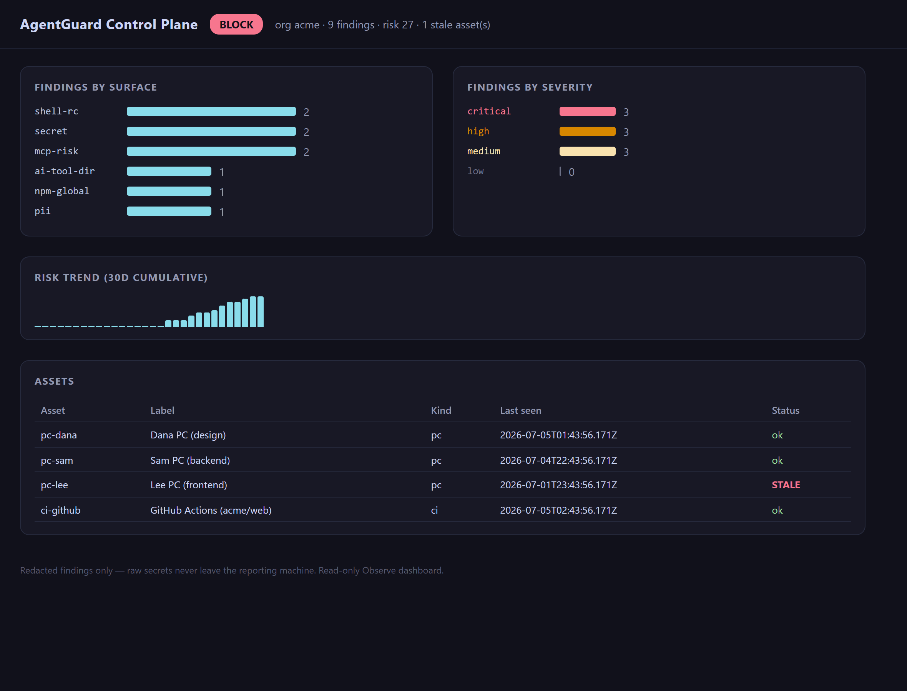
</p>

```bash
cd control-plane
npm install
npm test        # 178 tests: 세션 인증, 정책 동기화, 오프보딩 웹훅, CVE, MCP 카탈로그, wire-skew, 서명 인증, 서버 redaction, 멀티테넌트 격리, Postgres 계약, acceptance E2E
npm start       # http://127.0.0.1:8787
```

| Method · Path | 설명 |
|---|---|
| `POST /v1/enroll` | 자산 등록 (CI = OIDC, PC = 디바이스 토큰) |
| `POST /v1/reports` | redacted 리포트 수집 (서명 + 300초 freshness + 서버측 독립 redaction 재검사, 위반 시 422) |
| `GET /v1/dashboard/summary` | surface·severity·자산별 findings 집계 (org 범위) |
| `GET /v1/dashboard/trend` | 30일 누적 리스크 추이 |
| `GET /v1/assets` | 자산 목록 + stale 경고 |
| `GET /v1/findings` | 필터 가능한 findings 목록 |
| `GET /?org=<id>` | 관리자 HTML 대시보드 (선택적: `enableHtmlDashboard`, 기본값은 404 — 순수 JSON API) |

모든 read 엔드포인트는 세션/토큰의 orgId로 엄격히 범위가 제한되어 cross-tenant 경로가 없습니다. 서버는 클라이언트 sweep과 **독립적인** shape+entropy 휴리스틱으로 redaction을 재검사하고, 위반 시 아무것도 저장하지 않고 422로 거부합니다.
## v0.5 — CLI 진화와 하이브리드 SaaS 컨트롤 플레인

v0.5는 세 갈래로 확장됩니다: **(1) 터미널 우선 CLI 검증 시스템**, **(2) 옵트인 하이브리드 SaaS 컨트롤 플레인**, **(3) 그 위의 same-origin 웹 콘솔** — 그리고 이를 개발 워크플로에 끼워 넣는 **pre-commit hook**과 **VS Code extension**입니다.

### CLI 동사 체계

```text
agentguard scan files|diff|log|mcp   (레거시: scan-files, scan-diff, scan-log, scan-mcp)
agentguard report [--push …]
agentguard doctor
agentguard posture
agentguard              # 또는 agentguard repl — 풀스크린 대시보드
agentguard open <path[:line]>
agentguard login|logout|enroll
agentguard hook install|uninstall
```

`scan files`/`scan diff`/`scan log`/`scan mcp` 두 단어 형태는 기존 하이픈 형태(`scan-files`/`scan-diff`/`scan-log`/`scan-mcp`)와 나란히 존재하는 **선언적 별칭 테이블**이며, 레거시 하이픈 형태는 flag/positional 파싱까지 포함해 **byte-identical**하게 계속 동작합니다 — 기존 스크립트·CI 워크플로는 그대로 사용할 수 있습니다. 풀스크린 대시보드(`agentguard`/`agentguard repl`)의 Fleet 탭·Offboard 탭은 각각 아래 컨트롤 플레인 fleet 집계와 오프보딩 웹훅 워크플로를 로컬 터미널에서 확인하는 뷰입니다.

### 컨트롤 플레인 확장 — 네이티브 인증, 정책, CVE, MCP 카탈로그

컨트롤 플레인은 여전히 **옵트인**이며, `--push` 없이는 모든 CLI 명령이 기존과 100% 동일하게 동작합니다. v0.5는 기존 device-token/OIDC 리포팅 위에 다음을 더합니다.

- **네이티브 세션 인증 + 조직/초대.** `POST /v1/auth/register|login|logout`, 관리자 전용 `POST /v1/orgs/invites` + `POST /v1/auth/accept-invite`, 그리고 CLI 전용 **device-authorization flow**(`/v1/auth/device/start|approve|poll`)로 `agentguard login`/`enroll`이 브라우저 없이도 세션을 발급받습니다. 쿠키 기반 세션은 CSRF 토큰(`x-agentguard-csrf` 헤더)으로 보호되며, 비밀번호는 해시로만 저장됩니다.
- **정책 동기화.** 조직 단위 정책 문서(YAML/JSON)와 예외(exception) 레코드를 ETag/`If-None-Match`로 동기화합니다. 조회는 모든 org 신원(세션 또는 viewer 토큰)에 열려 있고, 쓰기는 관리자 세션 + CSRF로 제한됩니다.
- **오프보딩 웹훅.** HR 시스템이 서명된 웹훅(`x-agentguard-webhook-signature` + timestamp freshness)으로 오프보딩 워크플로(`open → sweeping → done`)를 트리거하거나, 관리자가 세션으로 직접 생성할 수 있습니다. 자산은 직원 라벨/이메일로 매칭됩니다.
- **CVE 강화.** npm 전역 AI CLI 같은 package-shaped finding을 [osv.dev](https://osv.dev)에 배치 조회해 CVE/GHSA 심각도를 붙입니다. 캐시는 조직에 종속되지 않는(global) `cve_cache`에 TTL로 저장되고, ingest 경로는 **절대 CVE 조회를 기다리지 않으며**(fire-and-forget) 조회 실패는 "캐시된 값 재사용, stale 표시"로 조용히 무너집니다 — CVE 강화가 리포트 수집을 막을 수 없습니다.
- **MCP 카탈로그.** 조직이 로컬에서 관찰된 MCP 서버를 승인 목록으로 관리합니다(`GET/PUT /v1/mcp/catalog`). 새 서버는 기본적으로 `approved:false`(deny-by-default)로 시딩되며, 관리자만 승인 상태를 바꿀 수 있습니다.

### 웹 콘솔 — `web/`

컨트롤 플레인과 **같은 origin**에서 서빙되는 Next.js 콘솔입니다. 로그인 후 fleet 대시보드, Shadow-AI 실행 리포트(경영진용 요약), 정책, 오프보딩, CVE, MCP 카탈로그 페이지를 확인·조작할 수 있습니다. 셀프 호스팅 배포는 static export(`output: 'export'`)로 빌드되어 자체 서버 런타임·세션 저장소·API pass-through가 없고, 같은 origin이라 세션/CSRF 쿠키가 항상 first-party입니다(크로스사이트 쿠키·CORS 없음).

아래는 실제 웹 콘솔을 로그인 후 캡처한 화면입니다 (데모 조직 데이터 기준).

**로그인 — 조직 생성 / 로그인 (same-origin 세션 · CSRF 쿠키)**

<p align="center">
  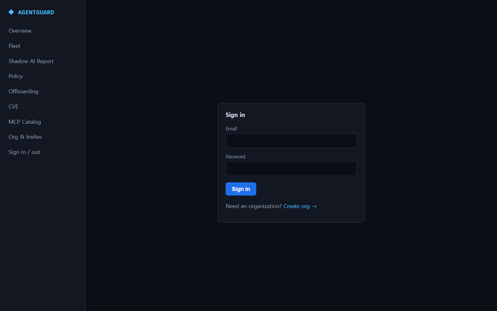
</p>

**Fleet 대시보드 — 조직 전체 posture (요약/추이/자산/findings)**

<p align="center">
  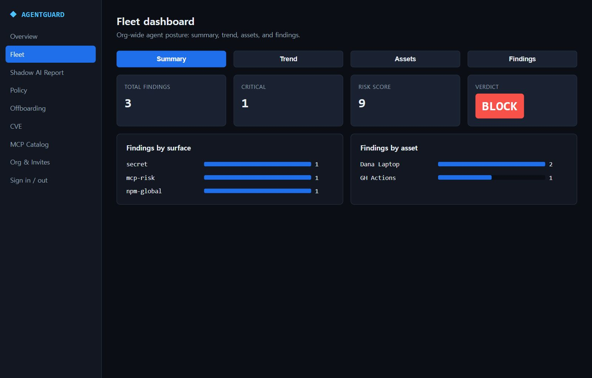
</p>

<table>
  <tr>
    <td width="50%">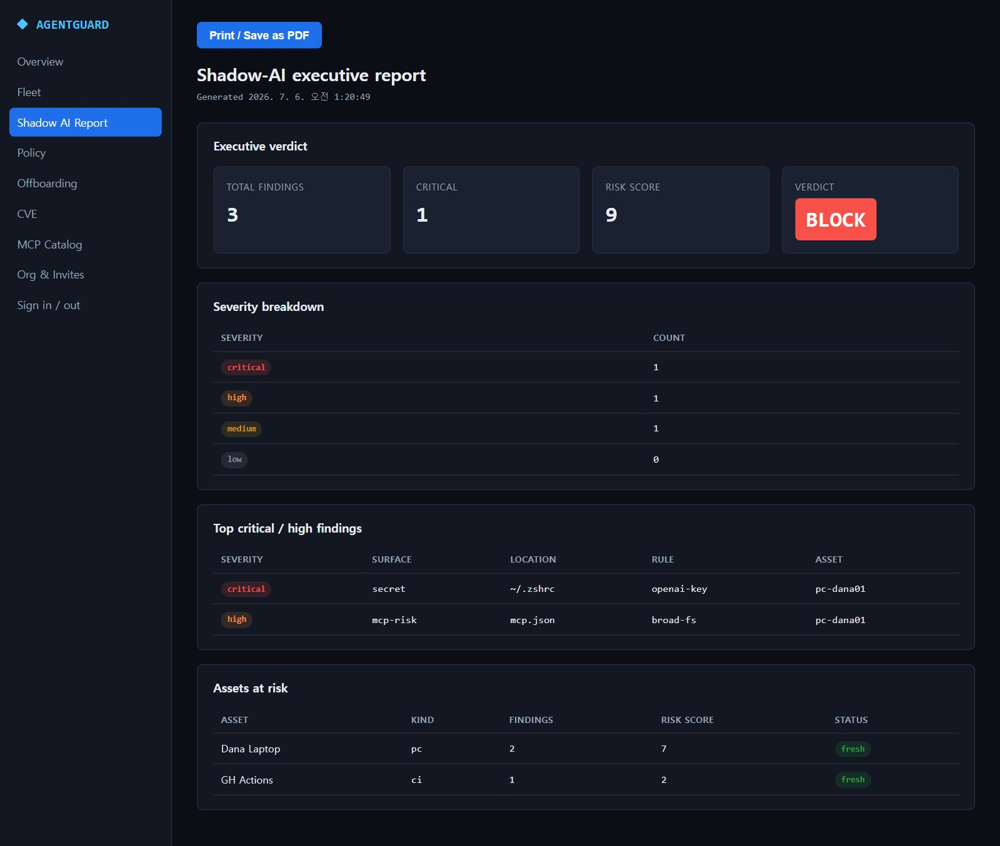<br/><sub><b>Shadow-AI 실행 리포트</b> — 경영진 요약(verdict·심각도 분포·상위 findings), 인쇄/PDF 친화</sub></td>
    <td width="50%">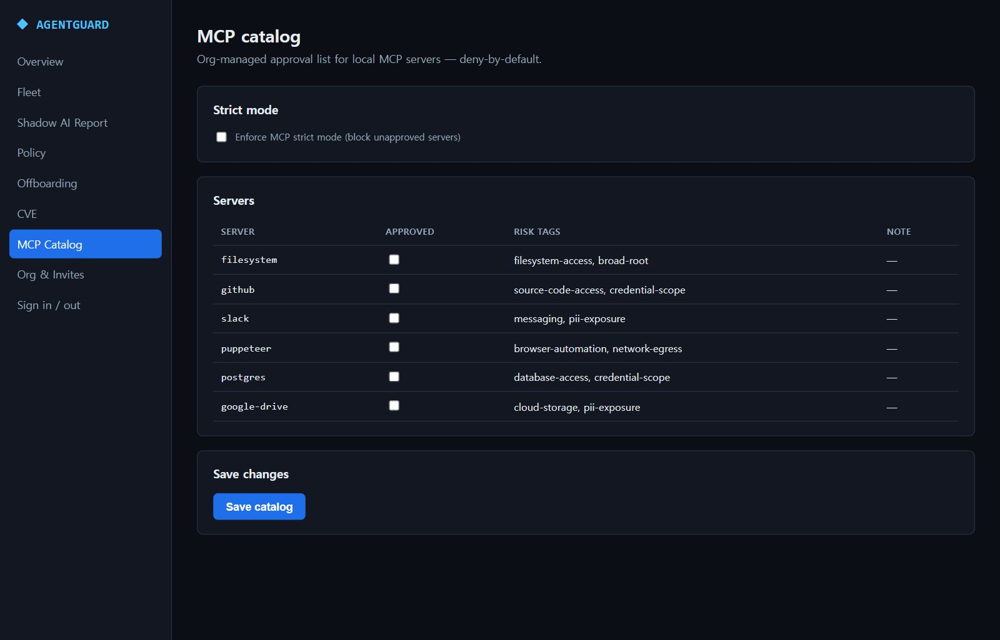<br/><sub><b>MCP 카탈로그</b> — deny-by-default 승인 목록, 리스크 태그, strict 모드 토글</sub></td>
  </tr>
</table>

### 개발 워크플로 통합 — pre-commit hook + VS Code extension

- **`agentguard hook install|uninstall`**은 staged diff를 스캔해 critical finding이 있으면 커밋을 막는 git pre-commit hook을 설치합니다(`core.hooksPath` 인식, 기존 hook 백업, agentguard-managed 마커로 안전한 재설치/제거).
- **VS Code extension**(`editors/vscode/`)은 `agentguard scan-files --json`을 실행해 findings를 네이티브 진단(Problems 패널의 빨강/노랑 물결선)으로 표시합니다. CLI를 번들하지 않고 `PATH`의 `agentguard`를 그대로 호출합니다.

### 셀프 호스팅

컨트롤 플레인 + 웹 콘솔을 직접 운영하려면 [셀프 호스팅 가이드](docs/self-hosting.md)를 참고하세요 — Docker Compose로 Caddy(리버스 프록시/TLS) + web(static export) + api(control-plane) + Postgres를 한 origin으로 묶어 배포하는 템플릿(`deploy/`)을 제공합니다.

## 로컬 개발

```bash
npm install
npm test
npm run typecheck
npm run build

# Example report
node dist/index.js scan-diff --out agent-risk-report.md < examples/risky-pr.diff
```

## Release checklist

배포 전 npm package에 built CLI와 의도한 metadata/assets만 포함되는지 확인합니다.

```bash
npm run build
npm pack --dry-run
```

Dry run에는 `dist/`, `README.md`, `package.json`, examples가 포함되어야 하고, `src/`나 `test/` files는 포함되면 안 됩니다.

- Run `npm test`
- Run `npm run typecheck`
- Run `npm run build`
- Run `npm pack --dry-run`
- Install the packed tarball in a temporary project and run `npx agentguard scan-log`
- Publish with `npm publish --provenance --access public`

태그 push 시 자동으로 provenance publish를 실행하는 release workflow와 토큰 설정은 [docs/release-process.md](docs/release-process.md)를 참고하세요.

## MVP 범위

- deterministic regex/rule scanner
- markdown/JSON report
- SARIF 2.1.0 output for GitHub code scanning
- external network calls 없음

## Roadmap

- MCP permission graph
- runtime guardrails / MCP proxy (detect → prevent; currently observe-only, v0.6+)
