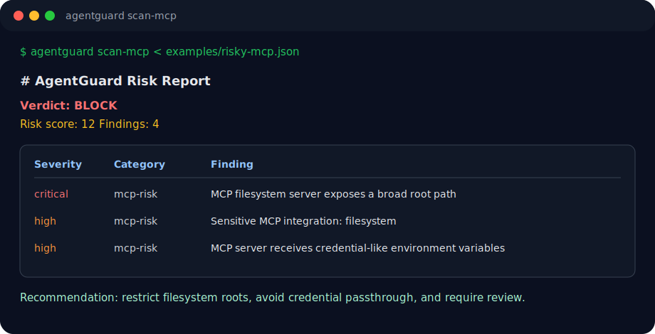

# AgentGuard

[English](README.en.md)


**Codex, Claude Code, Hermes, MCP 설정, 에이전트 트랜스크립트/로그, PR diff를 운영하는 한국 팀을 위한 한국어 우선 AgentOps 보안 스캐너.**

AgentGuard는 한국 팀이 에이전트 기반 개발을 운영할 때 노출될 수 있는 비밀 값, 위험한 MCP 권한, 에이전트 셸 동작, PR diff 리스크를 배포 전에 확인하도록 돕습니다. 지금의 한국어 우선 범위는 문서, 정책 설명, 팀 협업 가이드, 기본 터미널/Markdown 리포트입니다. CLI commands, rule IDs, JSON/SARIF/API/machine fields는 CI/CD와 글로벌 보안 도구 연동을 위해 English-compatible, global-standard 계약으로 유지합니다.

<p align="center">
  
</p>

## 설치

```bash
npm install -g agentguard
```

## 빠른 시작

```bash
# Scan a repo/workspace (기본 Markdown 리포트는 한국어)
agentguard scan-files .

# 영어 Markdown 리포트가 필요하면
agentguard scan-files . --lang en

# Scan a PR diff
git diff origin/main...HEAD | agentguard scan-diff

# Emit SARIF for GitHub code scanning
git diff origin/main...HEAD | agentguard scan-diff --sarif --out agentguard.sarif

# Scan Codex/MCP config
agentguard scan-mcp < ~/.codex/config.toml

# 로컬 SaaS 미리보기: 브라우저/API에서 같은 CLI 엔진 실행
agentguard serve --port 8787
```

브라우저에서 `http://127.0.0.1:8787`을 열면 MCP 설정, PR diff, 에이전트 로그, 일반 텍스트를 넣어 `PASS / REVIEW / BLOCK` verdict와 한국어 Markdown 리포트를 확인할 수 있습니다. 이 기능은 로컬 preview/API surface이며, 아직 hosted production SaaS, auth, billing, database, customer upload 기능을 주장하지 않습니다.

## 왜 필요한가

AI 코딩 에이전트는 이제 코드베이스, 터미널, GitHub, 데이터베이스, Slack, Drive, 내부 도구에 연결됩니다. 기존 SAST 도구는 애플리케이션 코드를 검사하지만, 다음 질문에는 충분히 답하지 못합니다.

> 에이전트가 무엇을 읽고, 실행하고, 노출하고, 변경하려 했는가?

AgentGuard는 한국어 우선 운영 문서와 정책 설명을 제공하면서도 자동화와 보안 도구가 기대하는 영어 기반 계약은 유지합니다.

## 검사 대상

| Surface | Examples |
|---|---|
| Secrets | OpenAI/Anthropic/GitHub/Google-style tokens, credential-shaped environment values |
| Agent logs | risky shell commands, sensitive paths, unsafe operations visible in transcripts/logs |
| PR diffs | newly-added secrets, PII, dangerous commands, agent policy violations |
| MCP/Codex config | broad filesystem roots, writable paths, credential passthrough, full-access servers |
| Policy files | YAML/JSON policy aliases, malformed policy documents, unsafe duplicates |

## 예시 finding

```text
BLOCK  secret.github_token
Found a GitHub token in an agent-visible diff. Evidence is redacted before reporting.

REVIEW  mcp.broad_filesystem_access
MCP configuration exposes a broad filesystem root with write-capable access.
```

Verdicts:

- `PASS`: findings 없음
- `REVIEW`: 사람이 검토해야 할 비치명 finding
- `BLOCK`: critical secret/full-access finding 또는 높은 aggregate risk

## 호환성 경계

한국어 README는 제품 포지셔닝, 운영 설명, 팀 협업 맥락을 한국어 우선으로 제공합니다. 하지만 다음 machine-facing 계약은 한국어로 바꾸지 않습니다.

- CLI commands: `agentguard scan-files`, `agentguard scan-diff`, `agentguard scan-mcp`
- Rule IDs: `secret.github_token`, `mcp.broad_filesystem_access`
- Markdown terminal reports: 기본값은 한국어, `--lang en`으로 영어 Markdown 출력 가능
- SARIF/API/machine fields: GitHub code scanning, JSON, SARIF 2.1.0, CI 파서가 읽는 필드 이름
- Package metadata and command flags: npm, shell, GitHub Actions에서 쓰는 영어 식별자

이 경계 덕분에 한국 팀은 문서를 한국어로 읽고 운영할 수 있고, CI/CD, SARIF, API, 보안 리포팅은 기존 글로벌 도구와 그대로 연동됩니다.

## 문서

- [GitHub Actions / SARIF setup](docs/github-action.md)
- [Policy files](docs/policy.md)
- [Rule surfaces](docs/rules.md)
- [Examples](docs/examples.md)
- [AX prelim submission pack](docs/ax-prelim-submission-pack.md)
- [AX prelim judge Q&A](docs/ax-prelim-judge-qa.md)
- [AX rule compliance checklist](docs/ax-rule-compliance-checklist.md)
- [AX demo scenario matrix](docs/ax-demo-scenario-matrix.md)
- [AX demo failure mode register](docs/ax-demo-failure-mode-register.md)
- [AX live demo runbook](docs/ax-live-demo-runbook.md)
- [AX 30-second demo command card](docs/ax-30-second-demo-card.md)
- [AX 90-second judge evidence tour](docs/ax-90-second-judge-evidence-tour.md)
- [AX before/after rollout demo](docs/ax-before-after-rollout-demo.md)
- [AX agent rollback drill](docs/ax-agent-rollback-drill.md)
- [AX judge evidence index](docs/ax-judge-evidence-index.md)
- [AX judge evidence ladder](docs/ax-judge-evidence-ladder.md)
- [AX rollout control map](docs/ax-rollout-control-map.md)
- [AX CI reviewer handoff](docs/ax-ci-reviewer-handoff.md)
- [AX real judge demo map](docs/ax-real-judge-demo-map.md)
- [AX judge handoff packet](docs/ax-judge-handoff-packet.md)
- [AX submission readiness scorecard](docs/ax-submission-readiness-scorecard.md)
- [AX onsite triage card](docs/ax-onsite-triage-card.md)
- [AX onsite pivot guide](docs/ax-onsite-pivot-guide.md)
- [AX Rollout references](docs/ax-rollout-references.md)
- [AX reference refresh drill](docs/ax-reference-refresh-drill.md)
- [AX evidence freshness checklist](docs/ax-evidence-freshness-checklist.md)
- [AX policy exception decision tree](docs/ax-policy-exception-decision-tree.md)
- [AX competitive comparison](docs/ax-competitive-comparison.md)
- [AX competitor objection answer card](docs/ax-competitor-objection-answer-card.md)
- [AX company problem intake kit](docs/ax-company-problem-intake-kit.md)
- [AX final company-problem worksheet](docs/ax-final-problem-worksheet.md)
- [Roadmap](docs/roadmap.md)
- [Development harness](docs/harness-workflow.md)

## 예제 파일

- [`examples/risky-mcp.json`](examples/risky-mcp.json) — 위험한 MCP filesystem config
- [`examples/risky-pr.diff`](examples/risky-pr.diff) — fake secret-like material이 포함된 PR diff
- [`examples/agent-transcript.log`](examples/agent-transcript.log) — 위험한 shell behavior가 포함된 agent transcript
- [`examples/expected-report.md`](examples/expected-report.md) — sample markdown report
- [`examples/agentguard.sarif`](examples/agentguard.sarif) — sample SARIF payload

## GitHub code scanning workflow

아래 workflow를 `.github/workflows/agentguard-sarif.yml`로 복사하면 pull request diff를 스캔하고 `agentguard.sarif`를 생성한 뒤 GitHub code scanning에 업로드합니다. `scan-diff --sarif --out agentguard.sarif` 명령은 현재 구현된 CLI flags와 일치합니다.

```yaml
name: AgentGuard code scanning
on:
  pull_request:
    branches: [main]
    types: [opened, synchronize, reopened]

permissions:
  contents: read
  security-events: write

jobs:
  agentguard-sarif:
    runs-on: ubuntu-latest
    steps:
      - uses: actions/checkout@v4
        with:
          fetch-depth: 0

      - uses: actions/setup-node@v4
        with:
          node-version: 22
          cache: npm

      - run: npm ci
      - run: npm run build

      - name: Emit AgentGuard SARIF
        run: |
          git diff --unified=0 ${{ github.event.pull_request.base.sha }}...${{ github.event.pull_request.head.sha }} \
            | node dist/index.js scan-diff --sarif --out agentguard.sarif || true

      - name: Upload AgentGuard SARIF
        uses: github/codeql-action/upload-sarif@v3
        with:
          sarif_file: agentguard.sarif
```

## GitHub PR comment workflow

아래 workflow를 `.github/workflows/agentguard-pr.yml`로 복사하면 pull request diff를 스캔하고 markdown report를 artifact로 보존하며, 같은 report를 PR comment로 게시합니다. Critical findings는 check를 실패시키고, review-level findings는 사람이 검토할 수 있도록 check를 green으로 유지합니다.

```yaml
name: AgentGuard PR scan
on:
  pull_request:
    branches: [main]
    types: [opened, synchronize, reopened]

permissions:
  contents: read
  pull-requests: write

jobs:
  agentguard:
    runs-on: ubuntu-latest
    steps:
      - uses: actions/checkout@v4
        with:
          fetch-depth: 0

      - uses: actions/setup-node@v4
        with:
          node-version: 22
          cache: npm

      - name: Run AgentGuard on PR diff
        id: agentguard
        uses: ./.github/actions/agentguard
        with:
          base-sha: ${{ github.event.pull_request.base.sha }}
          head-sha: ${{ github.event.pull_request.head.sha }}
          report-path: agent-risk-report.md

      - name: Upload AgentGuard report
        if: ${{ !cancelled() }}
        uses: actions/upload-artifact@v4
        with:
          name: agentguard-pr-report
          path: agent-risk-report.md

      - name: Comment AgentGuard report on PR
        if: ${{ !cancelled() }}
        uses: peter-evans/create-or-update-comment@v4
        with:
          issue-number: ${{ github.event.pull_request.number }}
          body-path: agent-risk-report.md
```

## 로컬 개발

```bash
npm install
npm test
npm run typecheck
npm run build

# Example report
node dist/index.js scan-diff --out agent-risk-report.md < examples/risky-pr.diff
```

## Release checklist

배포 전 npm package에 built CLI와 의도한 metadata/assets만 포함되는지 확인합니다.

```bash
npm run build
npm pack --dry-run
```

Dry run에는 `dist/`, `README.md`, `package.json`, examples가 포함되어야 하고, `src/`나 `test/` files는 포함되면 안 됩니다.

- Run `npm test`
- Run `npm run typecheck`
- Run `npm run build`
- Run `npm pack --dry-run`
- Install the packed tarball in a temporary project and run `npx agentguard scan-log`
- Publish with `npm publish --provenance --access public`

## MVP 범위

- deterministic regex/rule scanner
- markdown/JSON report
- SARIF 2.1.0 output for GitHub code scanning
- external network calls 없음

## Roadmap

- Codex/Hermes transcript adapters
- MCP permission graph
- dashboard for agent audit trails
